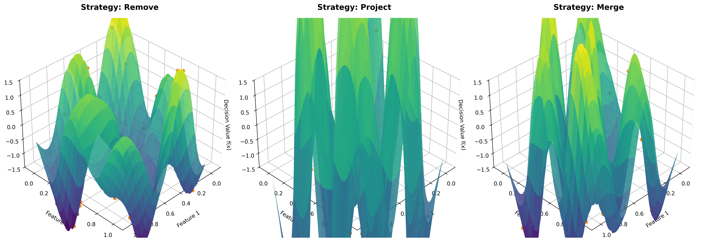
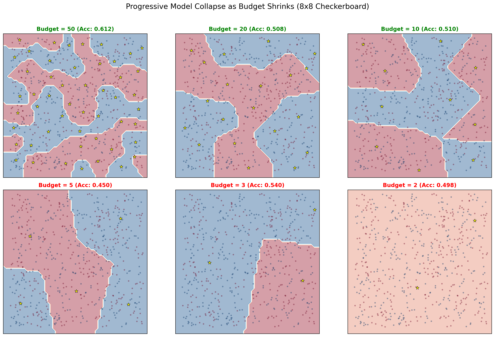
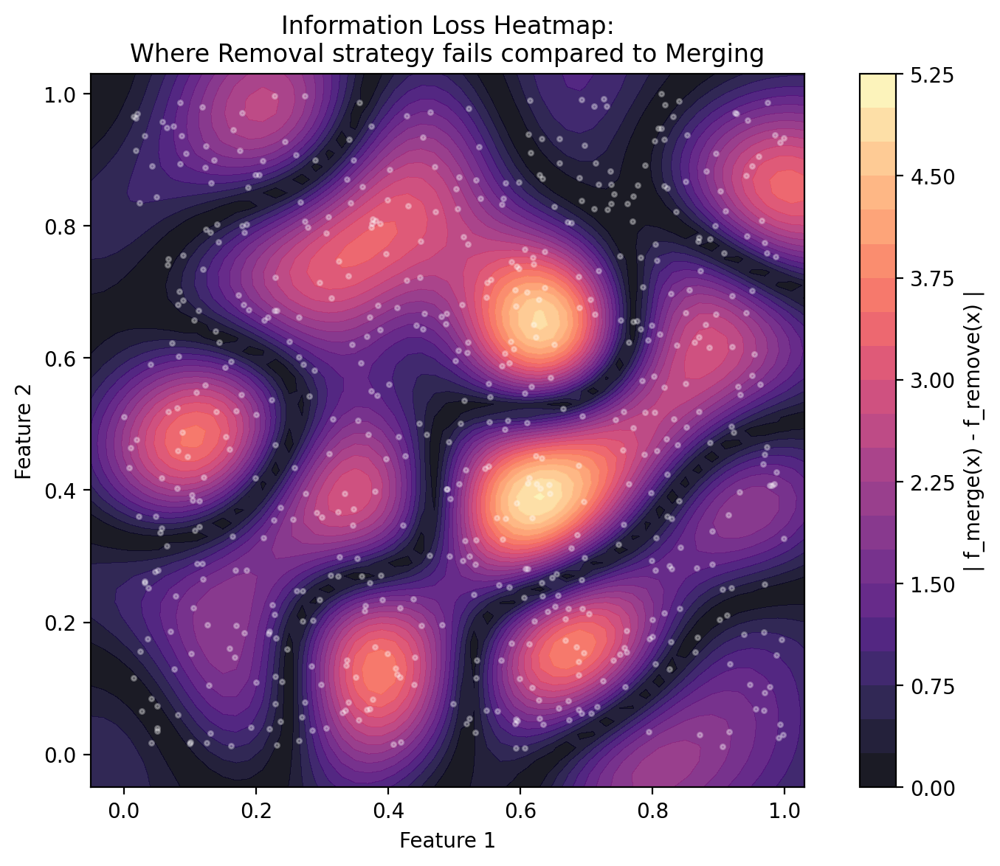

# Breaking the Curse of Kernelization: BSGD Reproduction

## Project Overview

This repository contains a complete reproduction, evaluation, ablation, and failure-mode analysis of the paper **"Breaking the Curse of Kernelization: Budgeted Stochastic Gradient Descent for Large-Scale SVM Training"** (Wang, Crammer, and Vucetic, JMLR 2012). 

The goal of this project is to study the mechanisms of Budgeted Stochastic Gradient Descent (BSGD), specifically the **BPegasos** algorithm, which scales Kernel Support Vector Machines to massive datasets by restricting the number of support vectors to a fixed budget $B$. 

## Key Visualizations and Results

### The Decision Surface (BPegasos with Merge Strategy)
The merging strategy combines adjacent support vectors to preserve model information. The resulting decision surface seamlessly captures complex, non-linear manifolds with strict memory bounds:

<p align="center">
  
</p>

### Failure Mode: Boundary Collapse under Extreme Budgets
When the budget $B$ shrinks relative to the complexity of the dataset (e.g., an 8x8 checkerboard feature space), the weight degradation at each budget maintenance step compounds exponentially. Below is an illustration of the progressive collapse of the decision boundary:

<p align="center">
  
</p>

### Divergence Heatmap (Merge vs. Remove)
Replacing the information-preserving Merge strategy with naive Removal completely destroys the classifier's ability to model complex decision boundaries. The heatmap below highlights the spatial magnitude of information loss:

<p align="center">
  
</p>

---

## Project Structure

| Component | Description | File |
|:---|:---|:---|
| **Step-by-Step Breakdown** | Detailed algorithm analysis mapping equations to concepts. | `task_1_1.ipynb` |
| **Key Assumptions** | Analysis of the three critical boundary/budget assumptions. | `task_1_2.ipynb` |
| **Baseline Comparisons** | Pegasos constraints versus BPegasos bounds. | `task_1_3.ipynb` |
| **Dataset Generation** | Synthetic 2D Checkerboard definition and preprocessing. | `task_2_1.ipynb` |
| **Core Implementation** | Complete BSGD codebase (Remove, Project, Merge operators). | `task_2_2.ipynb` |
| **Results Pipeline** | Full evaluation, bar charts, and 3D boundary visualizations. | `task_2_3.ipynb` |
| **Ablation Studies** | Removing regularization and swapping Merge for Removal. | `task_3_1.ipynb` |
| **Failure Analysis** | Forcing boundary collapse on an 8x8 checkerboard micro-budget. | `task_3_2.ipynb` |
| **Formal Documentation** | Academic IEEE-format summary of the entire effort. | `report.tex` / `report.pdf` |
| **LLM Logging** | Step-by-step logs of AI interactions during project development. | `llm_task_*.json` |

---

## Reproducibility Guarantee
All computations in this repository are fully deterministic and mathematically verifiable:
1. `RANDOM_SEED` is universally enforced across all notebooks.
2. `PYTHONHASHSEED` is locked.
3. Every notebook begins with an explicit Environment Output cell declaring the precise versions of Python, NumPy, Matplotlib, and scikit-learn.

### Execution Instructions
To execute the pipeline natively:
```bash
cd partB
pip install -r requirements.txt
jupyter notebook
```
Navigate to any notebook and run all cells sequentially. All scripts rely entirely on local synthetic generation and require no external dataset downloads.
